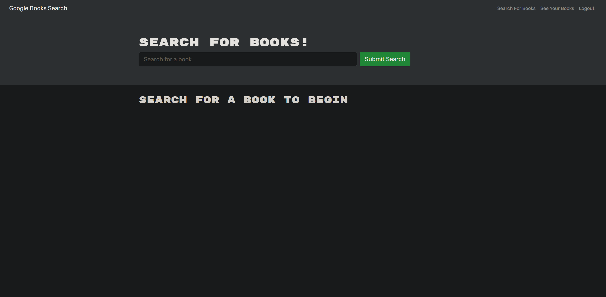

# Book Search Engine
	
  
  
## Purpose

This website allows you to create an account, search for books using the Google book API, and save them to your profile!

## Built With

- HTML
- CSS
- Node.js
- React
- Apollo
- Graphql

## Website

https://mike-book-search-engine.herokuapp.com/

## Contribution

Made by Mike Bashford
